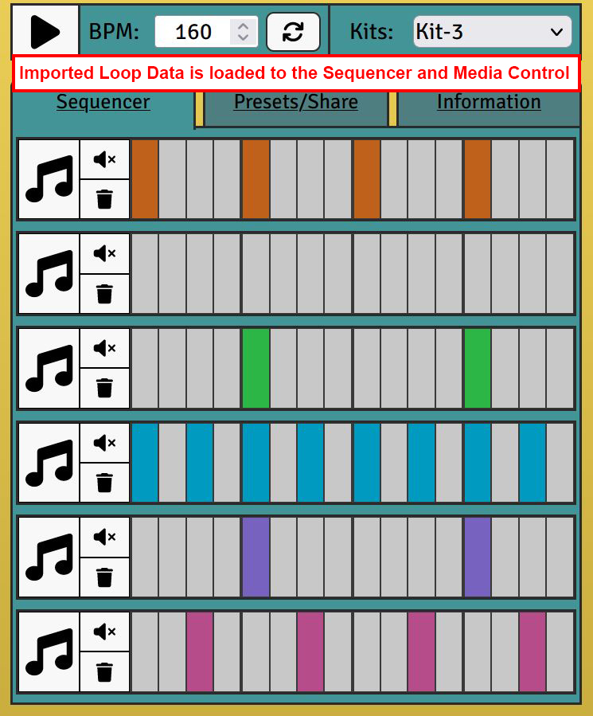
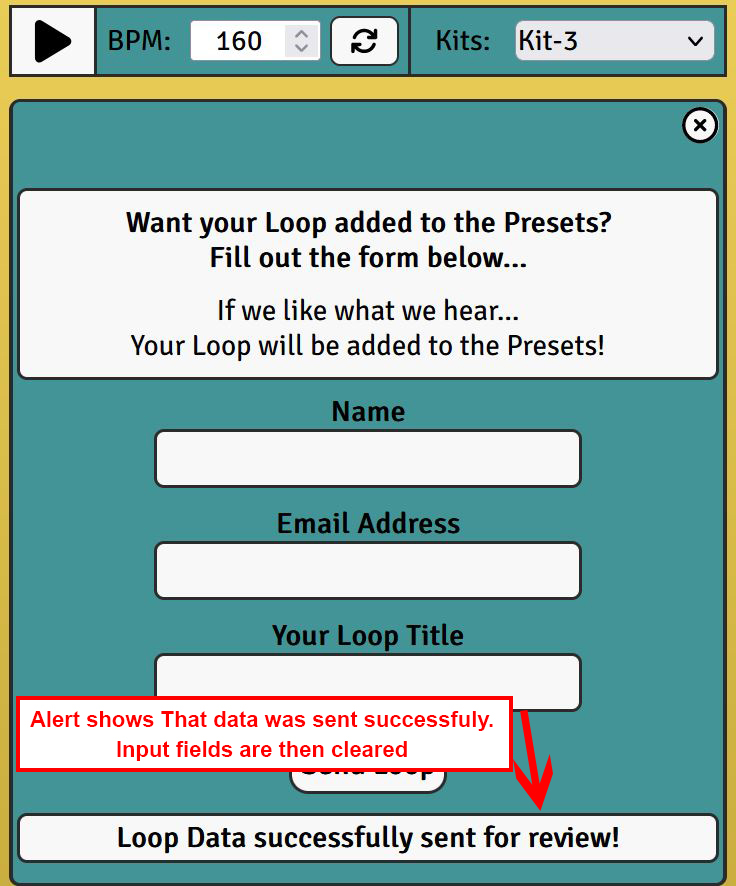

# Beat Maker - Drum Sequencer

**Developer: Adam Giles**

[Live website](https://adampgiles.github.io/CI_PP2_BM/)

## Table of Content

- [Project Goals](#project-goals)
- [User Experience](#user-experience)
    - [Target Audience](#target-audience)
    - [User Stories](#user-stories)
- [Design](#design)
    - [Colour](#colour)
    - [Fonts](#fonts)
    - [Structure](#structure)
    - [Wireframes](#wireframes)
- [Technologies Used](#technologies-used)
    - [Languages](#languages)
    - [Frameworks, Libraries & Tools](#frameworks-libraries--tools)
- [Features](#features)
- [Validation](#validation)
    - [HTML Validation](#html-validation)
    - [CSS Validation](#css-validation)
    - [JS Validation](#js-validation)
- [Testing](#testing)
    - [Accessibility](#accessibility)
    - [Performance](#performance)
    - [Device Testing](#device-testing)
    - [Browser Compatibility](#browser-compatibility)
    - [User Story Testing](#user-story-testing)
- [Bugs](#bugs)
- [Deployment](#deployment)
- [Credits](#credits)
- [Acknowledgements](#acknowledgements)

## Project Goals
Beat Maker is an interactive online drum sequencer. Featuring 6 tracks, 4 kits, 10 preset loops, adjustable tempo and import/export features to share your creations.

Beat Maker has the following goals;
- Give users a platform to create short music loops.
- Give users a platform to share their Beat Maker creations.

Users of Beat Maker have the following goals;
- To learn how to use Beat Maker features.
- To create music loops.
- To create music loop using different kits.
- To create music loops at different tempos.
- To export their Beat Maker music loops, to share with other users.
- To import other user's Beat Maker music loops, to listen to, or modify.

## User Experience

### Target Audience
- Individuals interested in music creation.
- Individuals interested in sharing musical creations.

### User Stories
User stories have been separated into two groups; Site Users and Site Owner. 

#### Site Users
1. I would like to create a music loop by interacting with a drum sequencer.
2. I would like to hear the loop playing while continuing to change the loop.
3. I would like to change the drum sounds to create different genre loops.
4. I would like to export or import loop data to collaborate with other users.
5. I would like to submit my loop to the site owner to be added to the loop presets.
6. I would like to have access to quick guide information to understand how to use the drum sequencer.

#### Site Owner
7. I would like users to be able to interact with the website to create music loops.
8. I would like users to receive feedback when interacting with site buttons, by changing the button colour when clicked.
9. I would like the user to be notified when the tempo of the loop has been updated.
10. I would like the website to be responsive, so I can be accessed via mobile, tablet and desktop.
11. I would like the website to have a loop submission form with validation implemented so the form cannot be submitted blank or with invalid values.

## Design

### Colour
The site's colour scheme consists of five key colours; White, black, yellow, teal and light-blue. White is used for buttons and input fields. Black is used for text and icons. Yellow is used for the background and the Quick Guide text-boxes. Light-blue is used for clicked buttons.

### Font

One font was used on the site; Signika Negative, which is a clear and legible font.

### Structure

The website structure consists of a main page and 404 page. The main page has a persistent media control section at the top of the page and a section below consisting of three windows. Only one window is visible at a time and can be changed using tabs at the top of this section. 

The sections and windows are detailed below;

Media Control

- The Media Control contains a "Play/Stop" button, Tempo number input and Kit Selection dropdown.

Sequencer

- The first window contains the Sequencer. This section contains six tracks. Each track consists of a Drum Pad, mute button, clear button and a 16 step drum sequencer.

Preset/Share Window

- The second window contains the Presets and Share section. This section contains Preset selection instructions and a dropdown, Export and Import instruction, text input box and Export and Import buttons. When viewing this window a section shows below. This section contains text and a button inviting the user to submit their loop to be added to the presets. Clicking the button opens the Submission Window.

Submission Window

- The Submission Window contains a form with instructions. The form has text inputs for "Name", "Email Address" and "Loop Title", and a button to submit the form. There is also a text alert box below the button, which displays a message after clicking the button. This message changes based on the validity of the input and the current stage during loop submission. The form uses EmailJS, which is detailed further in a section below.

Information Window

- The third window contains the Information section. This section contains a Quick Guide, Credits and a copyright notice. The Quick Guide gives the user an overview of the drum sequencer features.

404 Page

A 404 page was created to ensure that a user can easily navigate back to the Beat Maker site if they encounter a page which does not exist.

### Wireframes

Wireframes

## Technologies Used

### Languages

- HTML
- CSS
- Javascript

### Frameworks, Libraries & Tools

- [Am I Responsive](http://ami.responsivedesign.is/), used to create a devices mock-up image. 
- [Balsamiq](https://balsamiq.com/), used to create wireframes.
- [Favicon.io](https://favicon.io), used to create the site favicon.
- [Font Awesome](https://fontawesome.com/), used for all site icons.
- [Git](https://git-scm.com/), used for version control within VSCode to push the code to GitHub.
- [GitHub](https://github.com/), used to store project code.
- [Google Fonts](https://fonts.google.com/), used to acquire the site's fonts.
- [EmailJS](https://dashboard.emailjs.com) is utilised to supply the site owner with user submitted Loops via email.
- [WC3 Validator](https://validator.w3.org/), [Jigsaw W3 Validator](https://jigsaw.w3.org/css-validator/), [Wave Validator](https://wave.webaim.org/), [Lighthouse](https://developers.google.com/web/tools/lighthouse/) and [Am I Responsive](http://ami.responsivedesign.is/), used to test the site's code, performance, accessibilty and responsiveness. 

## Features

The website consists of six sections with thirteen features.

### Media Controls
- Situated in a persistent position at the top of the page.
- Contains the playback button, tempo control and kit selection.
- The playback button can be clicked to Play or Stop the loop playback.
- The Tempo control consists of a number input and refresh button. The number input changes the tempo value, which is in beats per minute. The tempo can then be updated by clicking the refresh button. The tempo value is limited between 60 and 200. A tooltip shows this range when entering a value and when clicking refresh, the tooltip shows that the tempo has been updated.
- The Kit selection area consists of a dropdown with 4 options. These 4 options change the drum sounds on each of the drum sequencer tracks. Selecting an option immediately updates the sounds.
- Meets user stories: 1, 2, 3, 7, 8, 9.

### Tab Navigation
- Situated below the Media Control.
- Contains three tabs for each of the three windows.
- When clicked the tabs change the window.
- The first tab (Sequencer), shows the sequencer window.
- The second tab (Presets/Share), shows the presets and share window.
- The third tab (Information), shows the information window.
- When a tab is clicked, the other tab's background colours change to a darker colour. This is to show that the tab's window is not active. Only in-active tabs will change the window, clicking an active tab has no effect.

### Sequencer
- Situated below the Tab Navigation section, connected to the first tab.
- Contains six drum tracks
- Each of the six tracks consists of a Drum Pad, Mute button, Clear button and a 16 Step Sequencer.
- The Drum pad plays an audio sample of the track's sound when clicked. The pad's colour changes temporarily when clicked to give visual feedback to the user, informing them that the button was clicked.
- The Mute button will mute the track and stop the track's audio from playing during playback. The button's colour changes to visually inform the user that the mute button is active.
- The clear button toggles off any active steps in the track's step sequencer. The button's colour changes temporarily to provide visual feedback to the user that the change has occurred.
- The 16 Step Sequencers consists of 16 buttons. When a button is clicked the colour changes to provide visual feedback that the step is active. During playback, when the playback position reaches the step's position, if the step is active the track's sound will trigger.
- Each track's step has a different colour. This is to clearly show the different tracks and also to provide variety to the visuals.
- Meets user stories: 1, 2, 7, 8.

### Preset/Share Section
- Situated below the Tab Navigation section, connected to the second tab.
- Contains three sub-sections; Preset Loops, Sharing Loops and Submit for Review.
- The Preset Loops sub-section consists of a Heading, paragraph with short instructions, a dropdown and a refresh button. The dropdown contains a list of pre-made Loops, the user can select a loop then click the refresh button to load the loop into the Sequencer. The window will then automatically change to the sequencer window, populate the sequencer and the media control. This change provides visual feedback to the user that the change has occurred.
- The Sharing Loops sub-sections consists of a Heading, paragraph with instructions, a text input-box, a button to Export Loop and a button to Import Loop. When clicking the Export Loop button, the text input-box is populated with a Loop Data text string which has been compiled using Javascript. The user can then copy this text and share it with other users. The other users can then paste the Loop Data in the text input-box on their session of the site and click the Import Button. The Loop Data will then be decompiled and loaded to the sequencer. Both buttons when clicked, temporarily chance colour to visually notify the user that it has been clicked.
- The Submit for Review sub-section consists of a Heading and a button. The button when clicked, opens up a Submission Window. This window is detailed further in the section below.
- Meets user stories: 4, 5.

### Submission Window
- This window displays after clicking the "Submit Loop for Review" button on the Preset/Share window.
- Consists of a close button, a section containing a Heading and paragraph with instructions, and a section containing a form with a button, and an alert text box.
- The close button when clicked hides the submission window.
- The form consists of three text input fields and a button. The text inputs are for; Name, Email Address, and Your Loop Title. The button when clicked will submit the form.
- The form contains validation and will not submit if any of the fields are empty, and if the email address is not a valid email. The alert textbox will show below the button after clicking.
- The button can display four different messages;
1."Please enter details in all three text boxes"
2."Please enter a valid Email Address"
3."Please wait, sending details..."
4."Loop Data successfully sent for review!"
- Messages 1 and 2 display when trying to submit invalid inputs. Messages 3 and 4 display when submitting valid inputs.
- When submitting the form also submits the exported Loop Data.
- All form data is submitted through EmailJS and an email is sent to the site owner. This is detailed further in a section below.
- Meets user stories: 11.

### EmailJS
- [EmailJS](https://dashboard.emailjs.com) is utilised to supply the site owner with user submitted Loops via email.
- After the Submission Form is completed and submitted by the user, the data is collated into a email using an email template on emailJS. This email is then sent the the site owner's email address.
- Below are screenshots of the template and an example email;

EmailJS Template

Example Email

### Information Window
- Situated below the Tab Navigation section, connected to the third tab.
- Contains two sub-sections; Quick Guide, and Credits/Copyright Notice.
- The Quick Guide sub-section consists of a heading, sub-headings, text boxes and images.
- There are two images (Media control, and Track Section), each with text boxes above with arrows directed towards sections of the image. The text boxes contain information on the sections function.
- The Credits/Copyright sub-section consists of a heading and information on credits, and a copyright notice.
- Meets user stories: 6.

### 404 Page
- Page is display when a user encounter a page that does not exist (HTTP 404 response code).
- User provided with a link to return to the main site.

## Validation

### HTML Validation

W3C Markup Validation Service was utilised to validate the HTML of the website. Both the main page and 404 page pass with no errors or no warnings to show.

Main Page

404 Page

### CSS Validation

W3C Jigsaw CSS Validation Service was utilised to validate the website's CSS. When validating the website, 0 errors are found and 38 warnings. All 38 warnings are for "Due to their dynamic nature, CSS variables are currently not statically checked".

Website

### JS Validation

JSHint was utilised to validate the website's JS. The three scripts received the following results;

- drums.js received 4 warnings is relation to "Functions declared within loops referencing an outer scoped variable may lead to confusing semantics." The code is functioning correctly, so I have chosen not to make any changes to the 4 sections referenced. Three undefined variables are referenced; "AudioContext", this is used for the Web Audio API. "stepInterval", this is assigned to the SetInterval function so the interval can be cleared when the track is stopped or the tempo is updated. "ShowDrumWindow", this is a function in navigation.js which is loaded earlier in index.html.

drums.js

- navigation.js received 0 warnings.

navigation.js

- form.js received 0 warnings. Two undefined variables were referenced; "ExportLoop", this is a function in drum.js which is loaded earlier in index.html, and "emailjs", this is used for EmailJS. One unused variable was referenced (SendLoop), this loop is not called in the script but is called via an onclick event in index.html.

forms.js

## Testing

### Accessibility

WAVE WebAIM web accessibility evaluation tool was utilised to ensure the website met accessibility standards, passed with 0 errors.

Accessibility Test Result

### Performance

To test the performance of the website, Lighthouse in Google Chrome developer tools was used. Below is the outcome.

Performance Test Result

### Device Testing

The website was tested using Google Chrome Developer Tools - Device Toolbar to simulate different device viewports. 

The following device viewports were tested using the Device Toolbar;
- iPad Pro (Tablet screen test)
- iPhone 5/SE (Mobile screen test)

The website was also tested on the following physical devices;
- iPhone X
- iPhone 12 Pro Max
- Samsung Galaxy Note 8
- Kindle Fire 10

The following resolutions were tested using a Windows desktop PC;
- 1920 x 1080
- 3440 x 1440

### Browser Compatibility

The website was tested on the following browsers:
- Google Chrome
- Mozilla Firefox

### User Story Testing

1. I would like to create a music loop by interacting with a drum sequencer.

| **Feature**                          | **Action Required**                                                                      | **Expected Outcome**                                       | **Actual Outcome**|
| ------------------------------------ | ---------------------------------------------------------------------------------------- | ---------------------------------------------------------- | ----------------- |
| Sequencer and Media Control          | Use the Sequencer and Media Control features to create a loop                            | A music loop can be created                                | Works as expected |

Screenshot

2. I would like to hear the loop playing while continuing to change the loop.

| **Feature**                          | **Action Required**                                                                      | **Expected Outcome**                                       | **Actual Outcome**|
| ------------------------------------ | ---------------------------------------------------------------------------------------- | ---------------------------------------------------------- | ----------------- |
| Sequencer and Playback button        | Use the Sequencer while the playback button is set to PLAY                               | Playback continues while changing the loop                 | Works as expected |

Screenshot

3. I would like to change the drum sounds to create different genre loops.

| **Feature**                          | **Action Required**                                                                      | **Expected Outcome**                                       | **Actual Outcome**|
| ------------------------------------ | ---------------------------------------------------------------------------------------- | ---------------------------------------------------------- | ----------------- |
| Kit Selection                        | Change the Kit using the Kit selection dropdown                                          | Sequencer track sounds change                              | Works as expected |

Screenshot

4. I would like to export or import loop data to collaborate with other users.

| **Feature**                          | **Action Required**                                                                      | **Expected Outcome**                                       | **Actual Outcome**|
| ------------------------------------ | ---------------------------------------------------------------------------------------- | ---------------------------------------------------------- | ----------------- |
| Export, Import buttons and textbox   | Use the Export and Import buttons to generate Loop Data to share with other users        | Users can Export or Import Loops                           | Works as expected |

Screenshot

5. I would like to submit my loop to the site owner to be added to the loop presets.

| **Feature**                          | **Action Required**                                                                      | **Expected Outcome**                                       | **Actual Outcome**|
| ------------------------------------ | ---------------------------------------------------------------------------------------- | ---------------------------------------------------------- | ----------------- |
| Submission Form                      | User completes the submission form to send their loop for review                         | Users can Export or Import Loops                           | Works as expected |

Screenshot

6. I would like to have access to quick guide information to understand how to use the drum sequencer.

| **Feature**                          | **Action Required**                                                                      | **Expected Outcome**                                       | **Actual Outcome**|
| ------------------------------------ | ---------------------------------------------------------------------------------------- | ---------------------------------------------------------- | ----------------- |
| Quick Guide                          | Navigate to the Information Window to view the Quick Guide                               | User presented with information on how to use the Sequencer | Works as expected |

Screenshot

7. I would like users to be able to interact with the website to create music loops.

| **Feature**                          | **Action Required**                                                                      | **Expected Outcome**                                       | **Actual Outcome**|
| ------------------------------------ | ---------------------------------------------------------------------------------------- | -----------------------------------------------------------| ----------------- |
| Sequencer and Media Control          | Use the Sequencer and Media Control features to create a loop                            | A music loop can be created                                | Works as expected |

Screenshot

8. I would like users to receive feedback when interacting with site buttons, by changing the button colour when clicked.

| **Feature**                          | **Action Required**                                                                      | **Expected Outcome**                                       | **Actual Outcome**|
| ------------------------------------ | ---------------------------------------------------------------------------------------- | ---------------------------------------------------------- | ----------------- |
| Site Buttons                         | User clicks a button                                                                     | Button colour changes temporarily                          | Works as expected |

Screenshot

9. I would like the user to be notified when the tempo of the loop has been updated.

| **Feature**                          | **Action Required**                                                                      | **Expected Outcome**                                       | **Actual Outcome**|
| ------------------------------------ | ---------------------------------------------------------------------------------------- | ---------------------------------------------------------- | ----------------- |
| Tempo tooltip                        | User clicks the Tempo refresh button                                                     | Tooltip shows "Tempo Updated"                              | Works as expected |

Screenshot

10. I would like the website to be responsive, so I can be accessed via mobile, tablet and desktop.

| **Feature**                          | **Action Required**                                                                      | **Expected Outcome**                                       | **Actual Outcome**|
| ------------------------------------ | ---------------------------------------------------------------------------------------- | ---------------------------------------------------------- | ----------------- |
| Website Responsiveness               | Access website on different devices                                                      | Website functions correctly on different devices           | Works as expected |

Screenshot

11. I would like the website to have a loop submission form with validation implemented so the form cannot be submitted blank or with invalid values.

| **Feature**                          | **Action Required**                                                                      | **Expected Outcome**                                       | **Actual Outcome**|
| ------------------------------------ | ---------------------------------------------------------------------------------------- | ---------------------------------------------------------- | ----------------- |
| Form Validation                      | Invalid or Empty form inputs will not submit and display alert. Only valid data submits  | Website functions correctly on different devices           | Works as expected |

Screenshot

## Bugs

| Bug                                                                          | Fix                                                                                                                                      |
| -----------------------------------------------------------------------------| -----------------------------------------------------------------------------------------------------------------------------------------|
| Preset 5 not importing to sequencer.                                         | Option value corrected on index.html.                                                                                                    |
| Any key input was toggling loop playback.                                    | Space bar event listener corrected to "===" (3 equals).                                                                                  |
| Non-whole numbers could be entered in BPM input.                             | Set number to round to nearest whole number on refresh.                                                                                  |
| Tempo tooltip not hiding if input clicked but not changed.                   | Changed eventListener to blur.                                                                                                           |
| Submission form was submitting blank data through emailjs.                   | Removed ".value" when setting parameter values.                                                                                          |
| EmailJS sending empty loopData.                                              | Assigned to ID value.                                                                                                                    |
| Submission-input-block not showing.                                          | Added missing div closing tag to information-window.                                                                                     |

## Deployment

### GitHub Pages
The website was deployed using GitHub Pages by following these steps:
1. Navigate to the Settings tab in the GitHub repository.
2. Select Pages on the left hand side menu. 
3. For source; select Branch: main.
4. After saving, GitHub will refresh and the website will publish from the GitHub repository.
5. A link to the published website will show: "Your site is published at "https://adampgiles.github.io/CI_PP2_BM/"

### Forking the GitHub Repository
1. Go to the GitHub repository
2. Click on Fork button in top right corner.

### Making a Local Clone
1. Navigate to the GitHub repository 
2. Select the Code button above the files.
3. Select the "HTTPS" tab on the dropdown window to clone with HTTPS, copy the link.
4. Open Git Bash.
5. Change the current working directory to the location where you would like the cloned directory.
6. Type "git clone " and paste the URL from the clipboard (example: "$ git clone https://github.com/YOUR-USERNAME/YOUR-REPOSITORY")
7. Press Enter to create.

## Credits

### Images/Icons
- All website Icons taken from [FontAwesome](https://fontawesome.com/).

### Code
- EmailJS code used and modified from YouTube tutorial [Code with Voran](https://www.youtube.com/watch?v=dgcYOm8n8ME).
- Email validation regular expression code from [Abstract](https://www.abstractapi.com/guides/email-validation-regex-javascript).

## Acknowledgements
Thank you to the following individuals for their support during the creation of this website; 
- Mo Shami, my Mentor, who provided excellent guidance and feedback throughout. 
- My partner and friends, for supporting with device testing and creating preset loops.